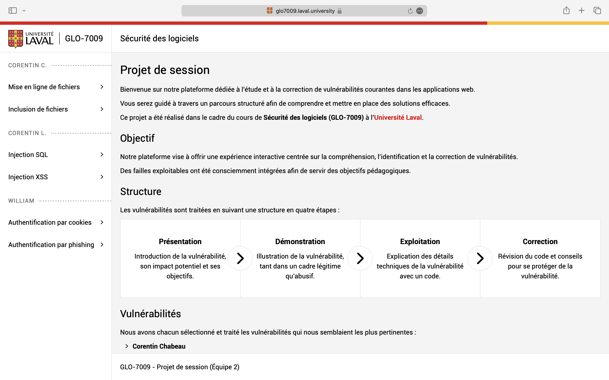

# GLO-7009 - Projet de session (Équipe 2)


__Bienvenue dans la documentation du projet !__

Ce projet a été réalisé dans le cadre du cours de **Sécurité des logiciels (GLO-7009)** à l'Université Laval.

Cette plateforme vise à offrir une expérience interactive centrée sur la compréhension, l’identification et la
correction de vulnérabilités.

Des failles exploitables ont été consciemment intégrées afin de servir des objectifs pédagogiques.



## Rapport du projet

__[:briefcase: Rapport du projet](rapport.pdf)__

## Présentation du projet

__[:film_projector: Présentation du projet](presentation.pdf)__

## Organisation du projet

* __[:books: documentation/](documentation/)__

  Ressources utiles à l'installation, à la configuration et à l'utilisation du projet.

* __[:framed_picture: images/](images/)__

  Images présentent dans cette documentation.

* __[:rocket: source/](source/)__

  Dossier principal contenant le code source du projet.

## Démonstration du projet

Une version en ligne du projet est accessible depuis
[https://glo7009.laval.university/](https://glo7009.laval.university/).

## Installation du projet

1. Importer la base de données « [/documentation/database.sql](documentation/database.sql) » dans phpMyAdmin.

2. Copier les fichiers du dossier « [source/](source/) » vers le dossier d'hébergement.

3. Modifier le fichier « [/includes/config.php](source/includes/config.php) » du dossier d'hébergement.

   ```php
   $config = array(
       /*****************************************************
        *                      WEBSITE                      *
        *****************************************************/
       "site_link" => "http://localhost", # Lien du site (pas de / à la fin !)
       "site_path" => "ABSOLUTE PATH", # Chemin absolu du répertoire racine du site (pas de / à la fin !)
       "site_mail" => "glo7009@laval.university", # Adresse courriel de destination

       /*****************************************************
        *                      DATABASE                     *
        *****************************************************/
       "db_name" => "glo7009", # Nom de la base de données
       "db_user" => "root", # Nom d’utilisateur
       "db_password" => "root", # Mot de passe
       "db_host" => "localhost" # Nom de l’hôte
   );
   ```
